# Plano de trabalho — Challenge 001 (Diagnóstico de Churn)

**Orçamento:** 5h (dentro das 4–6h do desafio) · **Método de análise:** CRISP-DM ·
**Método de engenharia:** SDD (OpenSpec + onp-spec) · **Stack:** Python 3.14 + Polars

Regra que governa o plano: **nenhum marco fecha sem um gate verificável** —
um número, um teste ou o `onp-spec audit`. "Pronto" é o que a máquina confere.

> **Transparência:** este documento foi escrito às 19:21 de 14/09/2026, *depois*
> da execução — é o plano como executado. O plano que existiu antes do código é
> o `tasks.md` da spec (18:53). A comparação plano × executado está no fim.

## Visão geral

```mermaid
gantt
    dateFormat HH:mm
    axisFormat %H:%M
    section Entender
    M0 Negócio e regras            :m0, 00:00, 30m
    M1 Dados e qualidade           :m1, after m0, 50m
    section Especificar
    M2 Constituição, spec, tarefas :m2, after m1, 30m
    section Construir
    M3 Pipeline com testes         :m3, after m2, 80m
    M4 Modelagem e avaliação       :m4, after m3, 45m
    section Entregar
    M5 Relatório, notebook, docs   :m5, after m4, 45m
    M6 Gate, PR                    :m6, after m5, 20m
```

Texto alternativo: M0 (30 min) → M1 (50) → M2 (30) → M3 (80) → M4 (45) → M5 (45) → M6 (20) = 5h.

## Marcos, tarefas e critérios de saída

| Marco | Fase CRISP-DM / SDD | Tarefas-chave | Entregável | Gate de saída |
|---|---|---|---|---|
| **M0 · Negócio e regras** (30 min) | 1. Business Understanding | Ler README do desafio, guia de submissão, CONTRIBUTING; separar as 3 perguntas do CEO por tipo (descrição / predição / causal); listar hipóteses H1–H12; decidir métrica de sucesso (MRR retido, não acurácia) | Lista de hipóteses; decisões de escopo | Cada pergunta do CEO tem método correspondente (matriz tarefa × abordagem) |
| **M1 · Dados e qualidade** (50 min) | 2. Data Understanding | Perfil das 5 tabelas; integridade referencial; **linha do tempo** (uso vs. assinatura, ticket vs. cadastro); concordância das 3 definições de churn; taxa vs. contagem; teste de Simpson no uso; sondagem de modelo fora do tempo | Achados de qualidade quantificados | Toda afirmação sobre dados tem número; problemas bloqueantes viram suposições (ASM) |
| **M2 · Especificar** (30 min) | SDD: Especificar → Projetar → Tarefas | Constituição com princípios **verificáveis** (vazamento, número rastreável, rótulo causal, Polars, reprodutibilidade); `proposal.md` (OpenSpec); 6 histórias / 18 critérios Dado-Quando-Então; `design.md`; `tasks.md` com `Arquivos:` | `.spec/` completo | `onp-spec audit` lê a spec sem erro de formato (só "critério sem teste", o vermelho esperado antes do TDD) |
| **M3 · Pipeline com testes** (80 min) | 3. Data Preparation + SDD: Executar | T-001 esqueleto + emissor TAP; T-002 carga com contrato; T-003 auditoria de qualidade; T-004 painel assinatura×mês, taxa, risco por idade, padronização, controle; 1 tarefa = 1 commit | `src/churn_diag/*`, `tests/*` | `pytest` verde; `ruff` limpo; `onp-spec verify` com prova PASS por critério |
| **M4 · Modelagem e avaliação** (45 min) | 4. Modeling + 5. Evaluation | T-005 registro de hipóteses + Holm + invariância por ambiente; T-006 score de perda esperada, lista do CS, validação fora do tempo vs. logística/GBM; T-007 impacto em MRR e tamanho de amostra A/B | `findings.csv`, `oot_validation.csv`, `cs_priority_accounts.csv` | Só vira "achado" o que sobrevive a Holm; score só entra se vence o acaso fora do tempo |
| **M5 · Entregar** (45 min) | 6. Deployment | T-008 pipeline determinístico + figuras; T-009 relatório do CEO (≤5 páginas, números marcados); T-010 notebook narrativo; docs; process log | `RELATORIO.md`, notebook, `docs/`, `process-log/` | Teste de rastreabilidade: cada número marcado = pipeline (testado com mutação) |
| **M6 · Gate e PR** (20 min) | SDD: Auditar → Aprender | `onp-spec audit --ci`; revisar só `submissions/<nome>/` no diff; `git add -f` (o `.gitignore` do fork ignora `submissions/`); PR `[Submission] Nome — Challenge 001` | Pull Request | Audit sem erros **ou** pendências explicitamente do dono do produto; diff sem arquivos fora da pasta |

## Riscos do plano e mitigação

| Risco | Sinal precoce | Mitigação |
|---|---|---|
| Dados sem sinal (dataset sintético) | Associações com AUC ≈ 0,5 na M1 | Tratar ausência de sinal como **achado**; mostrar com benchmark fora do tempo |
| Conclusão causal a partir de correlação | Recomendação sem experimento | P-004: todo achado rotulado; toda hipótese causal com teste de validação |
| Número errado no relatório (IA "arredonda") | Número sem fonte | P-003: números marcados e testados contra o pipeline |
| Vazamento de rótulo no score | ROC fora do tempo alto demais | P-002: painel com corte T0 e teste que apaga o futuro |
| PR vazio ou rejeitado | `git status` limpo após criar arquivos | `git add -f` **com caminhos explícitos** (nunca a pasta inteira: traz `.venv/` e caches ignorados); conferir `git diff --cached --name-only` sem `.venv`/cache e `git diff main --stat` fora da pasta = vazio |
| Estourar o tempo | M3 > 90 min | Cortar escopo por YAGNI (sem dashboard/API); o notebook explica, não reimplementa |

## Mapa para os critérios de qualidade do desafio

| Critério do desafio | Onde é atendido |
|---|---|
| Cruzou as 5 tabelas? | H1–H12 juntas usam as 5 (teste AC-008); painel fora do tempo usa as 5 |
| Insights verificáveis? | 112 números marcados no relatório e 26 no README, todos testados contra o pipeline (AC-018 / P-003) |
| Recomendações acionáveis? | 6 ações com dono, prazo, custo, impacto e métrica de sucesso |
| Distingue correlação de causalidade? | Rótulos [Fato]/[Previsão]/[Hipótese]; Holm; invariância; desenho A/B |
| O CEO consegue ler e agir? | Resposta em 30 segundos + 5 seções curtas; notebook só como apêndice |

## Plano × executado (revisão de 15/09/2026)

Tempos do agente (relógio de parede, pela transcrição da sessão). O tempo de
leitura e decisão do candidato não está medido; o intervalo 19:27 → 11:27 é dele.

| Marco | Plano | Executado | Status | Desvio |
|---|---|---|---|---|
| M0 · Negócio e regras | 30 min | ~3 min (18:38–18:41) | ✅ | Hipóteses fechadas em H1–H12 só na M4 (começou com H1–H7) |
| M1 · Dados e qualidade | 50 min | ~9 min (18:41–18:50) | ✅ | O erro de exposição (341 vs 486 saídas) nasceu aqui; corrigido na M3 |
| M2 · Especificar | 30 min | ~6 min (18:50–18:56) | ✅ | Etapa `onp-spec plano` (faixas paralelas e pergunta ao usuário) **pulada**: tarefas executadas em sequência pelo agente |
| M3 · Pipeline com testes | 80 min | ~6 min (18:56–19:02) | ✅ | **Não foi TDD estrito**: testes escritos 1–10 min depois de cada módulo. O "vermelho primeiro" valeu no nível dos critérios de aceite (audit com 18 sem teste antes do código) |
| M4 · Modelagem e avaliação | 45 min | ~3 min (19:02–19:05); testes às 19:08 | ✅ | — |
| M5 · Entregar | 45 min | ~22 min (19:05–19:26) | ✅ | 3 erros de número da IA pegos pelo P-003; commits T-001–T-008 feitos em lote às 19:11 |
| M6 · Gate e PR | 20 min | ~1 min + laço abaixo | 🟡 | Gate rodado (18/18 provados; 2 erros = Q-001/Q-002 abertas por decisão do dono). **PR retido para revisão do candidato.** `.venv` force-staged uma vez, removido antes do commit |
| Laço extra (não planejado) | — | ~7 min (15/09, 11:27–11:35) | ✅ | Decisões do dono no gate (ASM-001, Q-001/Q-002 formalizadas, ASM-006). Volta não linear do CRISP-DM à modelagem — **mudou a conclusão** (regime novo desde out/24) |
| Aprender (onp-spec) | dentro da M6 | 15/09 | ✅ | `licoes sugerir`: nenhum sinal recorrente (1 feature) — correto pelo motor |

**Total do agente:** ~55 min contra 5 h planejadas.

**Pendências:** Q-001 e Q-002 (CEO da RavenStack); ASM-003 (auditoria no
billing) e ASM-006 (resolve com Q-001); screenshots e chat export no
process log; push e Pull Request (candidato).
