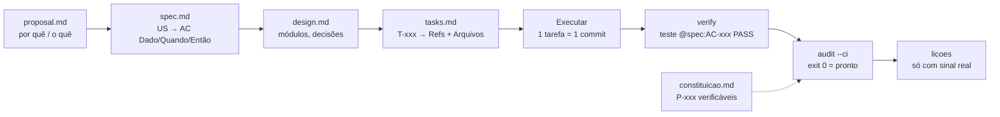

# Arquitetura, padrões de projeto e Spec-Driven Development

## 1. O fluxo SDD usado (e por quê)

Pela árvore de decisão da metodologia do candidato (*Methodology for Software
Development — Automatic SDLC workflow*): repositório existente (fork) + mudança
pequena e frequente → **OpenSpec** para a estrutura da mudança; e, para a
verificação, o **onp-spec** — o único do comparativo com *gate* mecânico
(a especificação é auditada contra o código por exit code).

Texto alternativo: proposta → especificação → design → tarefas → execução
(commit por tarefa) → verify → audit; a constituição alimenta o audit.

| Artefato | Caminho | Papel |
|---|---|---|
| Constituição | `solution/.spec/constituicao.md` | 8 princípios, 7 [DEVE] com verificação executável |
| Proposta (OpenSpec) | `solution/.spec/features/diagnostico-churn/proposal.md` | Why / What Changes / Impact |
| Especificação | `.../spec.md` | 6 histórias, 18 critérios, suposições e perguntas |
| Design | `.../design.md` | Módulos, protocolos, decisões e o que foi descartado |
| Tarefas | `.../tasks.md` | T-001…T-010 com `Refs:` e `Arquivos:` |
| Prova | `.spec/verification/diagnostico-churn.json` | Resultado por critério gravado pelo `verify` |

**Estado do gate:** 18/18 critérios com teste e prova PASS. O `audit --ci`
aponta apenas as perguntas Q-001/Q-002 e a suposição ASM-001, que dependem do
dono do produto — por desenho, a IA não pode "respondê-las" para passar.

A ponte pytest → onp-spec é um emissor TAP curto (`tests/conftest.py`):
o título TAP de cada teste leva as tags `@spec:AC-xxx`/`@principle:P-xxx` da
docstring. Zero dependência extra.

## 2. Constituição — o que a máquina garante

| Princípio | Risco que evita | Verificação |
|---|---|---|
| P-001 Todo requisito tem prova | "Implementei tudo" sem teste | gate intrínseco do audit |
| P-002 Nada do futuro no score | Vazamento de rótulo | regex proibida em `risk.py` + teste que apaga o futuro |
| P-003 Nenhum número digitado à mão | IA inventando/arredondando número | teste compara 102 números do relatório com o pipeline |
| P-004 Correlação ≠ causa | Recomendar ação com base em correlação | teste: todo achado rotulado; causal traz experimento |
| P-005 Polars em produção | Desvio de stack | regex proíbe `import pandas` em `src/` |
| P-006 Reprodutível | Resultado que muda a cada execução | `SEED` obrigatório + teste de bytes idênticos |
| P-007 Segredos fora do código | Vazamento de credencial | regex de chaves/senhas em `src/` |
| P-008 Dados brutos somente leitura | Corromper a fonte | regex proíbe escrita no diretório de dados |

## 3. SOLID, KISS, DRY, YAGNI — onde estão no código

| Princípio | Aplicação concreta |
|---|---|
| **S** — responsabilidade única | Um módulo por razão de mudar: `loader` (contrato), `quality` (auditoria), `metrics` (taxas), `hypotheses` (testes), `risk` (score), `impact` (dinheiro), `figures` (gráficos), `pipeline` (orquestração) |
| **O** — aberto/fechado | `REGISTRY` de hipóteses e protocolo `Scorer`: estender sem editar o executor (`hypotheses.run_all`, `risk.oot_validation`) |
| **L** — substituição | Qualquer `Scorer` (idade, perda esperada, só MRR, logística, GBM) é avaliado pelo mesmo `evaluate` sem condicional por tipo |
| **I** — interfaces enxutas | `Scorer` tem só `name`, `fit`, `score`; `Context` expõe só o que as hipóteses precisam |
| **D** — inversão de dependência | `analyse(tables, …)` recebe as tabelas prontas (sem I/O) — testável com fixtures; o caminho dos dados é injetado (`Settings`, `RAVENSTACK_DATA_DIR`) |
| **KISS** | Risco por idade em tabela de 5 linhas em vez de Cox/Causal Forest; controle 3σ em vez de TimesFM — e o simples venceu fora do tempo |
| **DRY** | Um único painel assinatura×mês alimenta taxa, risco, hipóteses, impacto e A/B; o notebook importa o pacote em vez de copiar código |
| **YAGNI** | Sem API, sem dashboard web, sem banco: CSV + relatório + notebook atendem o uso de amanhã (fora de escopo registrado na spec) |

## 4. AI-SDLC — como a IA entrou no ciclo sem perder o controle

| Elemento da metodologia | Nesta entrega |
|---|---|
| **Agente** | Claude Code (Opus 5) executa as tarefas a partir da spec |
| **Comandos** | `onp-spec new/verify/audit/tarefa`, `uv run python -m churn_diag`, `pytest`, `ruff` |
| **Gate mecânico** | `onp-spec audit --ci` + testes de princípio; a IA não declara "pronto" |
| **Revisão humana** | Suposições e perguntas abertas ficam para o dono do produto (ASM-001, Q-001, Q-002) |
| **Rastreabilidade** | História → critério → tarefa → teste → commit (`T-00X diagnostico-churn: …`) |

## 5. Desenvolvimento seguro

- **Validação de entrada:** contrato de schema com tipos estritos; erro nomeia
  tabela e coluna (`loader.enforce_contract`).
- **Sem rede, sem credenciais:** nada é baixado em tempo de execução; P-007 no gate.
- **Cadeia de dependências travada:** `uv.lock` com hashes; Python fixado em 3.14.
- **Dados somente leitura e sem PII:** dataset sintético (MIT); saídas só em `outputs/`.
- **Determinismo:** semente única, ordenação estável, PNG sem metadados de data.
