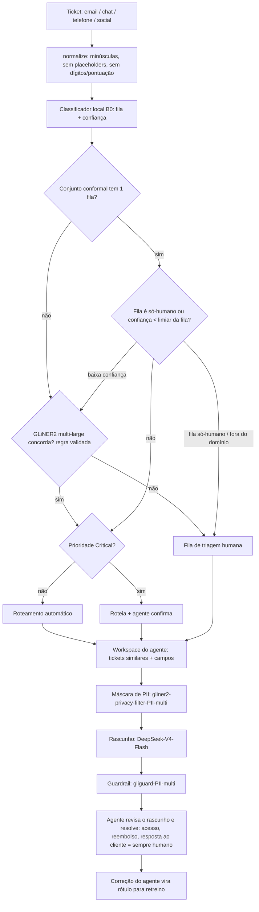

# Arquitetura, SDD e padrões aplicados

## 1. Fluxo proposto (ticket entra → decisão)

Onde a IA atua: normalização, classificação, decisão de roteamento, busca de
similares. Onde o humano decide: tudo que é incerto, a fila de sobra, o
Critical, e **toda resolução** — rotear não é resolver.

## 2. Componentes

| Componente | Linguagem | Responsabilidade | Dependências |
|---|---|---|---|
| `support_redesign` | Python 3.14 | Auditoria, diagnóstico, treino, fronteira, similares, ROI, export | Polars, SciPy, statsmodels, scikit-learn, model2vec |
| `support_redesign.pioneer` | Python 3.14 | Transporte: chave por ambiente, `store:false`, retentativa em 429/503 (aquecimento), cache em blocos | httpx (keep-alive) |
| `support_redesign.hosted` | Python 3.14 | Classificação `fastino/gliner2-multi-large-v1` → fallback `fastino/gliner2-large-v1`; LLM como classificador | — |
| `support_redesign.privacy` | Python 3.14 | Máscara `fastino/gliner2-privacy-filter-PII-multi`; guardrail `fastino/gliguard-PII-multi` | — |
| `support_redesign.drafting` | Python 3.14 | Rascunho `deepseek-ai/DeepSeek-V4-Flash` (máscara antes, guardrail depois, sem envio) | — |
| `router/` | Rust 1.98.1 | `POST /route`, `GET /health`; mesmo modelo e política; binários prontos em `dist/` (macOS, Linux musl estático, Windows) + modelo gzip | axum 0.8, tokio, serde, flate2 |
| `support_redesign.router_bin` | Python 3.14 | Escolhe e inicia o binário da plataforma; confere SHA-256; o app usa para subir o roteador sozinho | — |
| `app/streamlit_app.py` | Python 3.14 | Superfície do Diretor e dos agentes | streamlit, plotly |

Um processo por componente, sem banco, sem fila, sem container: o protótipo
roda em um notebook comum.

## 3. SDD: como o onp-spec governa o código

- **Constituição** (`solution/.spec/constituicao.md`): 13 princípios, cada
  `[DEVE]` com verificação executável (teste, regex proibido/obrigatório).
- **Features** (`solution/.spec/features/*`): `spec.md` (US/AC em
  Dado/Quando/Então, suposições, perguntas), `tasks.md` (T-xxx → AC + arquivos).
  Estilo OpenSpec: cada feature também declara *por quê / o que muda / impacto*
  no contexto e no "fora de escopo".
- **Prova**: cada teste carrega `@spec:AC-xxx` / `@principle:P-xxx` na
  docstring; `pytest --tap` emite TAP; `onp-spec verify` grava a prova;
  `onp-spec audit --ci` cruza spec ↔ tarefa ↔ teste ↔ código ↔ constituição.
- **Rust no mesmo gate**: um teste pytest executa `cargo test`, então a prova
  do roteador entra no mesmo TAP.

## 4. Padrões aplicados (e onde)

| Padrão | Aplicação concreta |
|---|---|
| **SRP** | Um módulo por responsabilidade (`audit`, `diagnosis`, `classifier`, `boundary`, `retrieval`, `cross`, `roi`, `export`); no Rust, `model` (pontuação) separado de `policy` (decisão) e de `main` (HTTP) |
| **OCP / DIP** | Classificadores implementam o mesmo protocolo `predict_proba(texts)`; a fronteira depende do protocolo, não do modelo — B0, B1 ou GLiNER2 entram sem mudar a política |
| **ISP** | O roteador só conhece `RouterModel` (vocabulário, idf, coeficientes) e `Policy` (limiares, regras) |
| **DRY** | Uma única `normalize` e um único analisador de n-gramas; os números do README vêm de `metrics.json` (P-003) |
| **KISS** | TF-IDF + LR exportado em JSON em vez de runtime ONNX; conformal em ~15 linhas em vez de biblioteca |
| **YAGNI** | Sem Docker, fila, banco, auth, streaming; Erlang C e cleanlab fora |
| **Secure SDLC** | Segredos só por ambiente (P-009); `store:false` no Pioneer; limite de tamanho e validação de entrada no `/route` (AC-029); sem `unwrap()` no roteador (P-011); lints `clippy::unwrap_used`/`todo`/`dbg_macro` = deny; máscara de PII antes do LLM e guardrail depois (P-013); atenção: o filtro de privacidade hospedado **vê o texto bruto** — em produção ele roda sob contrato com o provedor ou localmente (Q-004); nos testes só há PII Faker do Dataset 1 |
| **AI SDLC** | Toda afirmação de doc gerado por IA foi re-medida antes de virar requisito (ver `02`, §1); IA escreve, teste e audit decidem |
| **Clean Architecture** | Pioneer é um adaptador (porta = protocolo de classificador); trocar de provedor não toca na política |

## 5. Para produção (fora do protótipo)

- Autenticação e rate limit no `/route` (tower middleware), TLS no proxy.
- Log estruturado das decisões com id do modelo e limiares (auditoria).
- Retreino mensal com as correções dos agentes; recalibrar limiares e `q̂`.
- Monitorar: cobertura automática, precisão auditada por amostra, deriva de confiança.
