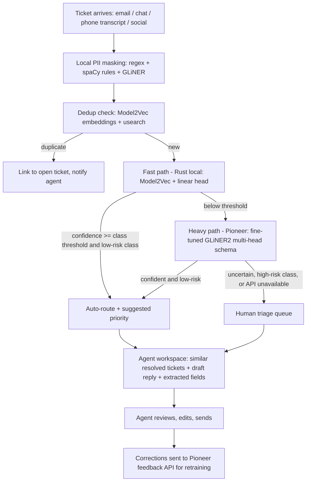

# Multi-Model Classifier (GLiNER2 / GLiFormer) — Technical Stack for Challenge 002 "Support Redesign"

**Scope:** Languages, tools, and architecture to deliver the four Challenge 002 deliverables (Operational Diagnosis, AI Automation Proposal, Functional Prototype, Process Log).
**Languages:** Python 3.14 (analysis, evaluation, orchestration) + Rust (serving, routing, high-throughput API clients).
**Development machine:** Mac Studio, Apple Silicon M-series Max, 32 GB unified memory.
**Model access:** Pioneer API (Fastino) at `https://api.pioneer.ai` for GLiNER2 (and GLiFormer, if enabled in the workspace — see §3.2), plus local models for the fast path and offline fallback.
**Time budget (challenge):** 4–6 hours → every choice favors *fast to set up, reproducible, measurable*.

> **Revision note (v2):** This version assumes Pioneer API access. GLiNER2 inference and fine-tuning move to Pioneer (hosted, no local GPU training needed). Local development keeps the Rust fast path (Model2Vec) and PII masking, and a local fallback for offline runs.
>
> **Revision note (v3):** §1.1 now contains **measured** data-quality findings from the actual files (`customer_support_tickets.csv`, `all_tickets_processed_improved_v3.csv`). Dataset 1 is confirmed synthetic; Dataset 2 is real but heavily preprocessed text. The diagnosis, benchmark expectations, cross-dataset step, and ROI model were adjusted accordingly.
>
> **Revision note (v4):** Aligned with the CRISP-DM companion documents. Added CRISP-DM phase mapping, the decision-layer tools (calibration, conformal prediction, cleanlab, queue simulation), and a compliance matrix for the README quality criteria.

**Companion documents:**
- `CRISP-DM-IT-Support-Challenge.md` — methodology: the six CRISP-DM phases applied to this challenge, non-linear loops, deliverable and quality-criteria mapping.
- `Guide of impementation and Analytic - IT Support.md` — analytical arsenal: statistical, ML, and human–AI decision techniques with step-by-step execution.
- This document — languages, tools, Pioneer API, and prototype architecture (the *how to build*).

---

## 0. Executive Summary

| Deliverable | Primary language | Core tools | Why |
|---|---|---|---|
| 1. Operational diagnosis (Dataset 1) | Python 3.14 | uv, Polars, DuckDB, SciPy/statsmodels, scikit-learn, Altair/Plotly, marimo | Fast columnar EDA, real statistical tests, reproducible reactive notebook |
| 2. AI automation proposal (Datasets 1 + 2) | Python 3.14 | Benchmark matrix: TF-IDF+LR, Model2Vec, **GLiNER2 zero-shot (Pioneer)**, **GLiNER2 LoRA fine-tuned on Dataset 2 (Pioneer)**, GLiFormer (Pioneer or local) | Proposal backed by measured accuracy **and** a confidence threshold that defines where humans take over |
| 3. Functional prototype | Rust + Python 3.14 | Rust: axum, model2vec-rs, usearch, reqwest (Pioneer native `/inference`), async-openai `byot` (OpenAI-compatible route). Python: dashboard + evaluation harness | Two-tier cascade: sub-millisecond local fast path; Pioneer GLiNER2 only for uncertain tickets |
| 4. Process log | Both | Git, Claude Code / Cursor transcripts, `decisions.md`, JSONL experiment log, Pioneer training/evaluation job IDs | Evidence of *how* AI was used, including model-training provenance |

**Core design principle:** *Calibrated classification confidence is the automation boundary.* The system auto-routes only when the model is confident; everything else — and every high-risk category — goes to a human. This directly answers the challenge warning that "automating 100% is a red flag."

### 0.1 CRISP-DM phase → stage and tools

| CRISP-DM phase | Stage in this document | Key tools |
|---|---|---|
| 1. Business Understanding | §1, §3.1–3.2 (Pioneer catalog check) | README analysis, `assumptions.yaml` |
| 2. Data Understanding | Stage 0, §1.1, Stage 1 audit | Polars, DuckDB, SciPy (χ², Kruskal-Wallis), statsmodels (power analysis) |
| 3. Data Preparation | Stage 0/1 cleaning, Stage 2.2 dataset prep | Polars, shared normalization function, Pioneer dataset upload, cleanlab |
| 4. Modeling | Stage 2 benchmark + decision layer | scikit-learn, Model2Vec, Pioneer GLiNER2 (zero-shot + LoRA), MAPIE, SimPy |
| 5. Evaluation | Stage 3.5 evaluation through the router, Stage 3.6 ROI | Rust router, Python eval harness, marimo |
| 6. Deployment | Stage 3 prototype, Stage 4 process log | axum, model2vec-rs, reqwest, Pioneer feedback API, Git |

---

## 1. Challenge Analysis (what is really being evaluated)

The README evaluates three skills at once: analytical (diagnosis), process thinking (what to automate and what **not**), and build capability (a working prototype on real data). Explicit quality criteria:

1. **Both datasets used and crossed.** Dataset 1 has operational metrics + free text; Dataset 2 has ~48K labeled texts in 8 categories. The "cross": fine-tune/validate the classifier on Dataset 2, then **apply it to Dataset 1 descriptions** to attach a predicted category to every operational ticket. Given the findings in §1.1, this cross is valuable mainly as a **domain-shift and robustness demonstration** (enterprise IT model vs templated consumer-electronics text), not as a source of real time/CSAT insights.
2. **Concrete numbers**, not generic statements (e.g. "macro-F1 0.87 on a stratified 20% hold-out; 71% of tickets auto-routable at ≥ 0.95 precision").
3. **Realistic automation** with explicit human-in-the-loop zones.
4. **Prototype on real data** — evaluated on the full hold-out split, not cherry-picked examples.

### 1.1 Measured data-quality findings (verified on the actual files)

Analysis run on the uploaded CSVs with pandas/SciPy/scikit-learn. All numbers below are reproducible and should be re-run in the challenge repo (`notebooks/00_data_quality.py`) and cited in the report.

#### Dataset 1 — `customer_support_tickets.csv` → **Synthetic (confirmed)**

| Check | Result | Signature of |
|---|---|---|
| Row count | **8,469 tickets** (README states ~30,000) | Volume assumption must be a parameter, not taken from the file |
| Template placeholders in `Ticket Description` | **100% of rows** contain `{product_purchased}`; **156 distinct** `{...}` placeholders overall (e.g. `{error_message}`, `{product_id}`) | Unrendered text-generation templates |
| `Resolution` text | Present only for `Closed` (32.7%); **100% unique**, random word salad (e.g. "West decision evidence bit.") | Faker-style lorem sentences, not agent resolutions |
| Customer emails | Only `example.com` / `example.org` / `example.net` | Faker-generated identities |
| Categorical distributions | Ticket Type 19.3–20.7% each (χ² uniform p = 0.115); Status 32.7–34.0% (p = 0.33); Priority 24.4–25.9% (p = 0.21); Channel 24.5–25.3% (p = 0.72); 42 products 2.1–2.8% (p = 0.48); Age uniform 18–70 (p = 0.55) | Independent uniform sampling |
| `Customer Satisfaction Rating` | 1–5 at 19.6–20.9% each; mean ≈ 3.0 in every segment | Uniform random |
| Independence of fields | `Ticket Subject` × `Ticket Type` χ² p = 0.98 (a "Refund request" subject is as likely under "Technical issue" as under "Refund request") | Columns generated independently |
| "Time" columns | `First Response Time` and `Time to Resolution` are **timestamps, not durations**, all inside a ~27-hour window (2023-05-31 21:53 → 2023-06-02 00:55), while purchases span 2020–2021 | Random timestamps |
| Temporal consistency | Among closed tickets, **49.3%** are "resolved" *before* the first response (resolution − first response ranges −23.2 h to +23.5 h, median +0.17 h) | Physically impossible → random |
| Bottlenecks | Kruskal-Wallis on (resolution − response) hours by Channel p = 0.46, Priority p = 0.64, Type p = 0.92 | No real bottleneck signal |
| CSAT drivers | Kruskal-Wallis CSAT by Channel p = 0.28, Priority p = 0.63, Type p = 0.70; Spearman(hours, CSAT) ρ = 0.02 (p = 0.25); Spearman(age, CSAT) ρ = −0.004 | No real satisfaction driver |
| Structural missingness | `Open` → no response, resolution, or CSAT; `Pending Customer Response` → response only; `Closed` → all fields | Rule-based generation (the only "real" structure) |

**Conclusion for Deliverable 1:** the dataset cannot support real conclusions about bottlenecks, satisfaction drivers, or waste. The strongest submission **says so with this evidence** instead of presenting noise as insight — this is exactly the analytical judgment the challenge evaluates.

#### Dataset 2 — `all_tickets_processed_improved_v3.csv` → **Real text, heavily preprocessed (not synthetic by these tests)**

| Check | Result | Interpretation |
|---|---|---|
| Rows / columns | 47,837 rows; only `Document` + `Topic_group` | No operational metrics exist → "near-uniform metrics" does not apply |
| Template placeholders | **0** rows with `{...}` | No generation templates |
| Duplicates | 0 exact duplicate documents; 0 conflicting labels | Clean |
| Class distribution | Hardware 28.5%, HR Support 22.8%, Access 14.9%, Miscellaneous 14.8%, Storage 5.8%, Purchase 5.2%, Internal Project 4.4%, Administrative rights 3.7% | **Realistic imbalance** (7.7× between largest and smallest) — the opposite of a synthetic uniform signature |
| Text form | 0 uppercase characters, 0 digits, punctuation in only 16 docs; 12,327-word vocabulary; median 26 words (max 981) | Lowercased, digits/punctuation and most names stripped, stopword-filtered ("work experience user work experience user hi …") |
| Content | Natural helpdesk intents with email residue ("please", "regards", "pm", "tuesday", job titles such as "senior engineer") | Anonymized real corporate IT tickets |
| Label noise | Some short docs are ambiguous (e.g. "old access old hi please old breakdown thank officer" → HR Support) | Caps the achievable accuracy; motivates human review for low-confidence and short tickets |
| Learnability | **TF-IDF (1–2 grams) + Logistic Regression: accuracy 0.866, macro-F1 0.868** on a stratified 20% hold-out (seed 42; weakest class Administrative rights F1 0.786, best Purchase 0.920) | Strong supervised signal; this is the **baseline to beat** |

**Implications for modeling:**
- The preprocessing removed grammar and casing. Encoder models like GLiNER2/GLiFormer were pretrained on natural text, so **zero-shot scores may underperform** on this corpus; LoRA fine-tuning (B4) and supervised baselines (B0/B1) are the realistic winners. Report this honestly if zero-shot trails TF-IDF.
- Apply **the same normalization** (lowercase, strip digits/punctuation) to any new ticket before the router — otherwise train/serve skew degrades accuracy.
- Dataset 2 contains little PII already; Dataset 1 PII is fake (Faker). Still run the masking step in the prototype to demonstrate it works.

#### How to use each dataset given these findings

| Dataset | Use for | Do not use for |
|---|---|---|
| Dataset 1 | (a) Demonstrating data-quality auditing; (b) a **reproducible diagnosis pipeline** ready for real data (same code, real numbers later); (c) exercising the router on unseen, domain-shifted, templated text; (d) PII-masking demo; (e) ticket volume mix only as illustrative | Claims about real bottlenecks, CSAT drivers, or measured waste |
| Dataset 2 | Training, calibration, thresholds, and all accuracy claims | Operational/time metrics (none exist) |

---

## 2. Language Split: Python 3.14 vs Rust

| Concern | Python 3.14 | Rust |
|---|---|---|
| EDA, statistics, charts | ✅ Primary | — |
| Dataset preparation + upload for Pioneer fine-tuning | ✅ Primary | — |
| Pioneer training jobs, evaluations, polling | ✅ Primary (httpx or `gliner2` client) | Possible, not needed |
| Local baselines (TF-IDF, Model2Vec head training) | ✅ Primary | — |
| Calibration, coverage/precision curve, thresholds | ✅ Primary | — |
| HTTP routing API, cascade logic, dedup, similarity search | — | ✅ Primary |
| Static embeddings at high throughput | OK | ✅ model2vec-rs |
| Bulk scoring through Pioneer (≈58K texts) | OK (asyncio) | ✅ reqwest + bounded concurrency + `Retry-After` handling |
| Local PII masking | ✅ spaCy rules + GLiNER | ✅ gline-rs (ONNX) optional |
| Dashboard | ✅ marimo / Streamlit | — |

**Rule of thumb:** Python owns *learning, measuring, and managing training jobs*; Rust owns *serving and deciding*.

### 2.1 Python 3.14 compatibility (as of Sept 2026)

With Pioneer hosting GLiNER2, the Python 3.14 risk drops sharply: the heavy PyTorch/transformers stack is no longer required for the main path.

| Package | 3.14 status | Note |
|---|---|---|
| httpx, pydantic v2, Polars, DuckDB, NumPy, SciPy, scikit-learn | ✅ | Core stack |
| `gliner2` (API client, no torch) | Pure Python | `pip install gliner2` installs schema/API/training-data utilities without torch; `gliner2[local]` adds torch |
| spaCy | ✅ from 3.8.13+ | Pin `spacy>=3.8.13` |
| model2vec (Python) | Validate at setup | Needed only to train the fast-path linear head |
| PyTorch (MPS) / `gliformer` local | ✅ torch wheels; gliformer requires ≥ 3.10 | Only for the offline fallback; if install fails on 3.14, isolate in a 3.13 `uv` env |

> **Setup gate (15 min max):** create envs, import every package, run one Pioneer inference and one local Model2Vec encode. Anything failing on 3.14 goes into a separate 3.13 env — don't debug inside the challenge budget.

---

## 3. Pioneer API — What It Provides and How to Use It

### 3.1 API surface relevant to this challenge

| Capability | Endpoint | Use in the challenge |
|---|---|---|
| Native schema inference (most expressive) | `POST /inference` | **Primary** for batch evaluation and the router's heavy tier: `model_id`, `text`, `schema`, `threshold` |
| OpenAI-compatible inference | `POST /v1/chat/completions` (base `https://api.pioneer.ai/v1`) | Drop-in via `async-openai` / OpenAI SDK; Pioneer fields such as `schema` go in the body (`extra_body` in Python SDK, `create_byot` in Rust) |
| Embeddings | `POST /v1/embeddings` | Optional comparison against local Model2Vec for similar-ticket retrieval (check which embedding models your catalog exposes) |
| Model catalog | `GET /base-models?supports_inference=true`, `GET /v1/models` | **First call of the project** — confirm exact model IDs available to your workspace |
| Fine-tuning | `POST /felix/training-jobs`, `GET /felix/training-jobs/:id` | LoRA fine-tune GLiNER2 on Dataset 2 |
| Evaluation | `POST /felix/evaluations`, `GET /felix/evaluations/:id` | F1 / precision / recall + per-label breakdown on the hold-out |
| Dataset management | `/felix/datasets/...` | Check dataset status is `ready` before training |
| Auto-labeling | `POST /generate/classification/label-existing` (1–1,000 texts per call) | Optional: silver labels for Dataset 1 text with a custom taxonomy (validate on a human-checked sample) |
| Inference history + feedback | `GET /inferences`, `POST /inferences/:id/feedback` | Human-correction loop in the proposal (maps to Adaptive Inference retraining) |
| Specialized models | `fastino/gliner2-privacy-filter-PII-multi`, `fastino/gliguard-LLMGuardrails-300M` | PII detection and guardrails (see §5.1 for where to run PII masking) |

**Authentication:** `X-API-Key: <key>` or `Authorization: Bearer <key>` — both accepted on all formats. Read the key from `PIONEER_API_KEY`; never hard-code or commit it.

**Schema keys for encoder (GLiNER) models:**

| Key | Type | Purpose |
|---|---|---|
| `entities` | `string[]` | NER labels |
| `classifications` | `object[]` — each `{task, labels, multi_label, top_k}` | One or more independent classification heads |
| `structures` | `object` | JSON/structured extraction |
| `relations` | `object[]` | Relation extraction |

All keys can be combined in a single request; the response carries each head separately. For **single-label** classification, `threshold` does not filter — the top label is always returned; use `top_k` to receive a ranked list and compute your own confidence margin.

### 3.2 Model selection on Pioneer

| Model ID | Role in this challenge |
|---|---|
| `fastino/gliner2-base-v1` | **Default** zero-shot baseline + LoRA fine-tune base (English, fast) |
| `fastino/gliner2-large-v1` | Higher-accuracy English variant — compare against base; pick by macro-F1 vs latency/cost |
| `fastino/gliner2-multi-v1` / `-multi-large-v1` | Only if you extend the router to Spanish/Portuguese tickets |
| `fastino/gliner2-privacy-filter-PII-multi` | PII detection (42 entity types, 7 languages) |
| `fastino/gliguard-LLMGuardrails-300M` | Optional: flag prompt-injection / unsafe content in inbound tickets before any LLM step |
| `<training-job-uuid>` | Your fine-tuned GLiNER2 classifier (served on a dedicated on-demand GPU) |

> ⚠️ **GLiFormer on Pioneer — confirm before building on it.** GLiFormer is a Knowledgator model. As of this revision, Pioneer's public model catalog lists only the GLiNER2 family, GLiGuard, and the PII filter as encoder models, although Pioneer notes that rollout-stage models may be feature-gated per workspace. **Action:** run `GET /base-models?task_type=encoder` with your key and record the exact GLiFormer `model_id` if it appears. If it does not, keep GLiFormer as a **local** benchmark row (`pip install gliformer`, `knowledgator/gliformer-large-v1`, PyTorch MPS) and do not put it on the prototype's critical path.

### 3.3 Operational limits and cost (plan the batch runs)

| Item | Value (per Pioneer docs) | Implication |
|---|---|---|
| `POST /inference` and `/v1/chat/completions` | 5,000 requests/min per user | Dataset 2 hold-out (~9.6K) ≈ 2 min; all Dataset 1 descriptions (~30K) ≈ 6 min at full rate |
| `POST /generate/*` | 120 requests/min | Auto-labeling is slow at scale → use only on samples |
| `POST /felix/training-jobs` | 20 requests/min | Irrelevant for a few jobs |
| Rate-limit error | `429` + `Retry-After` header | Client must sleep and retry |
| Credit errors | `402 out_of_credits`, `403 credit_ceiling_reached` | Do **not** retry; fail fast and log |
| GLiNER2 serverless pricing | $0.15 per 1M input tokens and $0.15 per 1M output tokens | Budget estimate: tickets are short; ~60K texts × a few hundred tokens ≈ tens of millions of tokens at most → single-digit USD. Measure actual usage in the dashboard and report it |
| Fine-tuned model serving | On-demand dedicated GPU (loaded after training) | Expect cold-start latency on first calls; warm it up before timing benchmarks |

### 3.4 Data governance on Pioneer

- **Inference persistence:** by default Pioneer stores each inference's input, output, and metadata (for evaluation, clustering, adapter training). Send **`"store": false`** on all benchmark and bulk-evaluation calls. Billing still applies.
- **PII:** mask Dataset 1 names/emails locally *before* any hosted call (§5.1). Dataset 2 is organizational IT text — scan a sample for names too.
- **Production proposal:** keep `store: true` only on the human-reviewed queue, where agent corrections are sent via `/inferences/:id/feedback` to drive retraining. This is an explicit, auditable human-in-the-loop mechanism.
- **Offline fallback:** the Rust fast path (Model2Vec) runs fully locally; if Pioneer is unreachable, uncertain tickets go straight to the human queue instead of failing.

---

## 4. Recommended Tools per Stage and Deliverable

### Stage 0 — Environment & data acquisition

| Need | Tool | Notes |
|---|---|---|
| Python toolchain | **uv** (`uv python install 3.14`, `uv add …`) | Lockfile = reproducibility evidence |
| Rust toolchain | **rustup** stable, `cargo`, `cargo-nextest` | Workspace: `crates/router`, `crates/pioneer`, `crates/embed`, `crates/dedup` |
| Secrets | `.env` (git-ignored) + `direnv`, or macOS Keychain via `security` CLI | `PIONEER_API_KEY` only from environment |
| Datasets | **kagglehub** | Raw CSV in `data/raw/`, Parquet in `data/interim/` |
| Pioneer smoke test | `curl` catalog + one inference | Record available model IDs in `process-log/decisions.md` |
| Local acceleration | PyTorch **MPS** (fallback only), ONNX Runtime **CoreML EP** (Rust, optional) | 32 GB is enough for local GLiFormer-large (575.6M params) if needed |

Repository layout:

```
challenge-002/
├── data/{raw,interim,processed}/
├── notebooks/            # marimo .py notebooks (git-diffable)
├── py/
│   ├── pioneer_client.py # async httpx client, retries, store=false
│   ├── prepare_datasets.py
│   ├── train_eval.py     # Pioneer training + evaluation jobs
│   └── benchmark.py      # local + hosted benchmark matrix
├── crates/               # Rust workspace: router, pioneer, embed, dedup
├── models/               # model2vec head, thresholds.json, label_map.json
├── reports/              # diagnosis.md, proposal.md, figures/
└── process-log/          # decisions.md, transcripts/, experiments.jsonl, pioneer_jobs.json
```

Pioneer smoke test:

```bash
export PIONEER_API_KEY=...   # from your secret store, never pasted into docs/chats

curl -s "https://api.pioneer.ai/base-models?task_type=encoder&supports_inference=true" \
  -H "X-API-Key: $PIONEER_API_KEY" | jq '.models[].id'

curl -s -X POST https://api.pioneer.ai/inference \
  -H "X-API-Key: $PIONEER_API_KEY" -H "Content-Type: application/json" \
  -d '{
    "model_id": "fastino/gliner2-base-v1",
    "text": "My laptop screen flickers and the docking station is not detected.",
    "schema": {
      "classifications": [{
        "task": "topic_group",
        "labels": ["hardware","hr support","access","storage","purchase",
                   "internal project","administrative rights","miscellaneous"],
        "multi_label": false,
        "top_k": 3
      }],
      "entities": ["hardware component","software","error symptom"]
    },
    "store": false
  }' | jq
```

> Inspect the actual response JSON from this call and freeze its shape in a Pydantic model (Python) and a `serde` struct (Rust). Don't assume field names for scores before seeing a real response.

### Stage 1 — Deliverable 1: Operational Diagnosis (Dataset 1)

Because Dataset 1 is synthetic (§1.1), structure the deliverable in **three layers**: (1) data-quality audit with evidence, (2) the diagnosis pipeline run anyway — showing null results with confidence intervals and effect sizes, and (3) a parameterized waste/ROI model the director can feed with real operational data.

| README question | Technique | Tools | Expected outcome on this file |
|---|---|---|---|
| **Is the data trustworthy?** (add as first section) | Placeholder regex scan, uniformity χ² tests, independence χ² tests, temporal-consistency check (resolution before response), resolution-text uniqueness, email-domain check | **Polars**, **SciPy** | Synthetic signatures listed in §1.1 |
| **Where does the flow get stuck?** | Convert timestamps to a handling interval; group by `Ticket Channel × Ticket Priority × Ticket Type`; median + p90; heatmap; Kruskal-Wallis with effect size (ε²) | **Polars** (lazy), **DuckDB**, **SciPy** | No significant differences (p = 0.46–0.92); show the flat heatmap as evidence |
| **What drives satisfaction?** | Ordinal logistic regression (CSAT 1–5); gradient boosting + permutation importance; mutual information; bootstrap CIs | **statsmodels** `OrderedModel`, **scikit-learn** | Near-zero importances; CSAT uniform ≈ 3.0 everywhere |
| **How much are we wasting?** | Waste = hours above a target SLA per segment × loaded cost/hour, all from `assumptions.yaml` (annual volume, handling-time distribution, SLA, cost) | Polars + YAML | Scenario-based estimate, clearly labeled as assumptions — the file's times cannot be used (49.3% negative intervals) |
| **Where is backlog risk?** | Status mix: 33.3% Open + 34.0% Pending Customer Response | Polars | Illustrative only (uniform by construction) |
| **Cross with Dataset 2** | Score Dataset 1 descriptions (after removing `{placeholders}`) with the Dataset 2 classifier → category distribution + confidence histogram | Rust bulk client / Python async client | Expect **low confidence / heavy "Miscellaneous"** (consumer electronics vs corporate IT) → evidence for the human-review threshold and for domain-specific retraining |
| Null-result credibility | Minimum detectable effect (power analysis) per test | **statsmodels** `stats.power` | ≈ 0.21 CSAT points detectable between channels (n ≥ 674/channel, SD 1.41) |
| Waste scenario | Erlang C formula or discrete-event simulation "as-is" vs "with AI triage" (measured coverage + misroute rate as inputs) | **SimPy** + `assumptions.yaml` | Agent hours and SLA breaches saved per month, with assumptions visible |
| Visualization | Heatmaps, uniformity plots, confidence histograms, scenario Pareto | **Altair** / **Plotly** | — |
| Narrative | Reactive notebook exported to HTML/Markdown | **marimo** | — |

**Output:** `reports/diagnosis.md` with the data-quality audit first, then null-result evidence with concrete numbers, then the parameterized waste model and a short "what we need from real data" list (true timestamps per state change, agent IDs, reopen counts, CSAT survey response rate).

### Stage 2 — Deliverable 2: AI Automation Proposal (Datasets 1 + 2)

#### 2.1 Benchmark matrix (Dataset 2, stratified 80/20, fixed seed)

| # | Approach | Where it runs | Mode | Role |
|---|---|---|---|---|
| B0 | TF-IDF (1–2 grams) + Logistic Regression | Local (scikit-learn) | Supervised | **Measured: accuracy 0.866, macro-F1 0.868** (stratified 20% hold-out, seed 42) — others must beat it |
| B1 | Model2Vec `potion-base-*` + linear head | Local (Python train, Rust serve) | Supervised | **Fast path** candidate: µs latency, offline |
| B2 | GLiNER2 base, zero-shot classification | **Pioneer** `fastino/gliner2-base-v1` | Zero-shot | Value without training; label-wording study |
| B3 | GLiNER2 large, zero-shot | **Pioneer** `fastino/gliner2-large-v1` | Zero-shot | Size vs accuracy trade-off |
| B4 | GLiNER2 base, **LoRA fine-tuned** on Dataset 2 train split | **Pioneer** training job → job UUID | Supervised | Expected accuracy ceiling for the heavy tier |
| B5 | GLiFormer classification (direct / embeddings / NER-as-classification) | Pioneer if catalog confirms it, else local MPS | Zero-shot | Architectural comparison; not on the critical path unless hosted |
| B6 | Classification-as-NER with GLiNER2 | **Pioneer** (`entities` with labels injected into text) | Zero-shot | Alternative formulation; robustness check |

**Expectation setting:** because Dataset 2 text is lowercased and stopword-stripped (§1.1), zero-shot rows (B2/B3/B5/B6) may land well below B0. The contribution of GLiNER2 is then expected from **fine-tuning (B4)** and from **multi-head extraction** (urgency, entities, structures) that TF-IDF cannot provide. A result where fine-tuned GLiNER2 only matches B0 on topic accuracy is still valuable if it adds calibrated confidence and extraction in one call — say so explicitly.

**Metrics per row:** accuracy, macro-F1, per-class F1, latency p50/p95 (measured from the Mac, including network for hosted rows), throughput, token cost, and **calibration** (Expected Calibration Error, reliability diagram).

**Confidence for hosted single-label heads:** request `top_k: 3` and compute (a) top-1 score and (b) margin = top-1 − top-2. Fit an isotonic or Platt calibrator on a validation split carved from the training portion (scikit-learn `IsotonicRegression` / `CalibratedClassifierCV` logic applied to the scores).

**Decision-layer tools:**

| Need | Tool | Use |
|---|---|---|
| Label-noise detection | **cleanlab** | Rank likely mislabeled Dataset 2 tickets from out-of-fold probabilities; inspect, prune/down-weight, retrain; examples for the "human judgment" argument |
| Calibration | **scikit-learn** `IsotonicRegression` | Map raw scores (TF-IDF, Model2Vec head, GLiNER2 top-k) to calibrated probabilities |
| Conformal prediction sets | **MAPIE** | Singleton set → eligible for auto-route; multi-class set → human |
| Cost-sensitive thresholds | NumPy/Polars + misroute cost matrix | Per-class threshold minimizing expected cost; high-risk classes may never auto-route |
| Domain-shift check | **SciPy** `ks_2samp` on confidence/margin (Dataset 2 hold-out vs Dataset 1) | Proves the router detects out-of-domain text |

> Validate `cleanlab`, `MAPIE`, and `SimPy` imports on Python 3.14 during the setup gate; they are pure Python or thin wrappers over NumPy/scikit-learn.

**Threshold selection ("where to stop"):** plot **coverage vs. precision** per class; choose the lowest threshold meeting a target precision (e.g. ≥ 0.95). Below it → human triage. Persist to `models/thresholds.json` (read by the Rust router).

#### 2.2 Fine-tuning GLiNER2 on Pioneer (B4)

1. **Prepare data** (`py/prepare_datasets.py`, Polars): single-label rows `{"text": Document, "label": normalized_topic}`, stratified train/validation/test. Normalize labels to readable lowercase phrases (e.g. `"administrative rights"`) and keep `label_map.json`. Never mix `label` and `labels` in one dataset — it fails validation.
2. **Upload** the train and test splits (dashboard upload with `text` + `label` columns), then confirm status `ready` via `GET /felix/datasets/{name}`.
3. **Train:**
   ```json
   POST /felix/training-jobs
   {
     "model_name": "support-topic-gliner2-base-lora",
     "base_model": "fastino/gliner2-base-v1",
     "datasets": [{"name": "it-tickets-train"}],
     "training_type": "lora",
     "nr_epochs": 5,
     "learning_rate": 5e-5
   }
   ```
4. **Poll** `GET /felix/training-jobs/{id}` until `complete` (`requested → running → complete | failed | stopped`). Start this early — it runs in parallel with the Dataset 1 analysis.
5. **Evaluate:** `POST /felix/evaluations` with `base_model = job id` and `dataset_name = it-tickets-test`; store per-label results.
6. **Independently re-evaluate** the job through your own harness (same hold-out, same metrics as B0–B6) so all rows are comparable and calibration can be computed.
7. Record job ID, dataset versions, hyperparameters, and metrics in `process-log/pioneer_jobs.json`.

If time allows, repeat with `fastino/gliner2-large-v1` or more epochs, and log each as a separate experiment.

#### 2.3 What to automate (validate each with data)

| Automation | Technique | Tool |
|---|---|---|
| Auto-classification + routing | Cascade: B1 local → B4 fine-tuned GLiNER2 on Pioneer, calibrated thresholds | Rust router |
| Priority triage **suggestion** | Second classification head (`urgency`: low/medium/high/critical) + `entities` for urgency cues (outage, data loss, security, deadline); human confirms Critical | Same Pioneer request, multi-head schema |
| Structured enrichment | `structures` schema: product, component, error message, affected users | GLiNER2 on Pioneer |
| Suggested responses | Top-k similar **resolved** tickets by embedding → show their resolutions as drafts | model2vec-rs + **usearch** (local) |
| Duplicate detection | Cosine threshold within a time window | usearch (Rust) or **SemHash** (Python) |
| PII masking | Local regex + spaCy `EntityRuler` + local GLiNER span NER before any hosted call | See §5.1 |
| Correction loop | Agent corrections → `POST /inferences/:id/feedback` → retraining | Pioneer feedback API |

#### 2.4 What NOT to automate (justify with data examples)

- Tickets below the per-class threshold, or with a small top-1/top-2 margin (multi-intent) → human triage.
- **"Miscellaneous"** predictions → human.
- **Critical priority, security/access escalations, "Administrative rights" requests** → human approval (authorization risk).
- **Billing disputes/refunds and repeat dissatisfied contacts** → human; AI only summarizes and drafts.
- **Outbound customer replies** → always agent-approved in v1; AI suggests, never sends.
- **Pioneer auto-labels** (`label-existing`) are not ground truth → spot-check a sample by hand before using them in any metric.

Pull 2–3 real ticket examples per bullet from the datasets for the report.

#### 2.5 Proposed operational flow



### Stage 3 — Deliverable 3: Functional Prototype (Rust + Python)

#### 3.1 Architecture

| Component | Language | Crates / packages | Responsibility |
|---|---|---|---|
| `router` (HTTP API) | Rust | **axum**, **tokio**, **serde**, **tower-http** (tracing, timeout) | `POST /route`, `POST /classify`, `POST /similar`, `GET /metrics` |
| `pioneer` client | Rust | **reqwest** (rustls), **serde_json**, **tokio**, **futures** (`buffer_unordered`), **governor** (client-side rate limiting) | Native `/inference` calls, `Retry-After` handling, `store:false` for benchmarks, circuit breaker → human queue |
| OpenAI-compatible client (optional) | Rust | **async-openai** with `byot` feature | Same models via `/v1/chat/completions` if you prefer the OpenAI-shaped route |
| `embed` | Rust | **model2vec-rs** | Local static embeddings + linear head (fast path) |
| `index` / `dedup` | Rust | **usearch** | Similar tickets, duplicates |
| `data` | Rust | **polars** / **arrow** | Load processed Parquet for indexing and bulk scoring |
| Bulk scoring CLI | Rust | **clap**, **indicatif** | Score full hold-out and Dataset 1 through the router/Pioneer |
| Evaluation harness | Python 3.14 | **httpx** (async), **pydantic**, **scikit-learn**, **Polars** | Metrics, calibration, thresholds, experiment log |
| Dashboard | Python 3.14 | **marimo** app or **Streamlit** | Bottleneck heatmaps, coverage/precision curve, live `/route` demo |
| Load test | CLI | **oha**, **criterion** | p50/p95 for the report |

#### 3.2 Rust: native Pioneer client (heavy tier)

```toml
# crates/pioneer/Cargo.toml
[dependencies]
reqwest = { version = "0.12", default-features = false, features = ["json", "rustls-tls"] }
serde = { version = "1", features = ["derive"] }
serde_json = "1"
tokio = { version = "1", features = ["full"] }
futures = "0.3"
anyhow = "1"
```

```rust
use anyhow::{bail, Result};
use reqwest::{Client, StatusCode};
use serde_json::{json, Value};
use std::time::Duration;

pub const TOPICS: [&str; 8] = [
    "hardware", "hr support", "access", "storage", "purchase",
    "internal project", "administrative rights", "miscellaneous",
];

pub struct Pioneer {
    http: Client,
    api_key: String,
    model_id: String, // base model ID or fine-tuned training job UUID
}

impl Pioneer {
    pub fn from_env(model_id: impl Into<String>) -> Result<Self> {
        Ok(Self {
            http: Client::builder().timeout(Duration::from_secs(30)).build()?,
            api_key: std::env::var("PIONEER_API_KEY")?, // never hard-code
            model_id: model_id.into(),
        })
    }

    /// Classify + extract in one forward pass. `store=false` for benchmarks.
    pub async fn route(&self, text: &str, store: bool) -> Result<Value> {
        let body = json!({
            "model_id": self.model_id,
            "text": text,
            "schema": {
                "classifications": [
                    { "task": "topic_group", "labels": TOPICS, "multi_label": false, "top_k": 3 },
                    { "task": "urgency", "labels": ["low", "medium", "high", "critical"],
                      "multi_label": false, "top_k": 2 }
                ],
                "entities": ["hardware component", "software", "error symptom"]
            },
            "store": store
        });

        for _attempt in 0..5 {
            let resp = self.http
                .post("https://api.pioneer.ai/inference")
                .header("X-API-Key", &self.api_key)
                .json(&body)
                .send()
                .await?;

            match resp.status() {
                s if s.is_success() => return Ok(resp.json::<Value>().await?),
                StatusCode::TOO_MANY_REQUESTS => {
                    let wait = resp.headers().get("retry-after")
                        .and_then(|v| v.to_str().ok())
                        .and_then(|v| v.parse::<u64>().ok())
                        .unwrap_or(1);
                    tokio::time::sleep(Duration::from_secs(wait)).await;
                }
                // 402 out_of_credits / 403 credit_ceiling_reached: retrying won't help
                StatusCode::PAYMENT_REQUIRED | StatusCode::FORBIDDEN => {
                    bail!("Pioneer credit limit: {}", resp.text().await?)
                }
                s => bail!("Pioneer error {s}: {}", resp.text().await?),
            }
        }
        bail!("Pioneer: max retries exceeded")
    }
}
```

Bulk scoring with bounded concurrency (stay well under 5,000 requests/min):

```rust
use futures::{stream, StreamExt};

pub async fn score_all(p: &Pioneer, texts: Vec<String>) -> Vec<anyhow::Result<serde_json::Value>> {
    stream::iter(texts)
        .map(|t| async move { p.route(&t, false).await })
        .buffer_unordered(32) // tune; measure throughput and 429 rate
        .collect()
        .await
}
```

> `buffer_unordered` returns results out of order — carry the ticket ID with each text (e.g. `(id, text)` tuples) before joining back to Dataset 1. Parse the response into a typed `serde` struct once you've seen the real JSON shape from the smoke test.

#### 3.3 Rust: OpenAI-compatible route (alternative)

```toml
async-openai = { version = "0.29", features = ["byot"] }  # confirm latest version
```

```rust
use async_openai::{config::OpenAIConfig, Client};
use serde_json::{json, Value};

pub async fn classify_openai_compat(text: &str, model: &str) -> anyhow::Result<Value> {
    let config = OpenAIConfig::new()
        .with_api_key(std::env::var("PIONEER_API_KEY")?) // sent as Bearer; Pioneer accepts it
        .with_api_base("https://api.pioneer.ai/v1");
    let client = Client::with_config(config);

    let payload = json!({
        "model": model, // e.g. "fastino/gliner2-base-v1" or a training job UUID
        "messages": [{ "role": "user", "content": text }],
        "schema": {
            "classifications": [{
                "task": "topic_group",
                "labels": ["hardware","hr support","access","storage","purchase",
                           "internal project","administrative rights","miscellaneous"],
                "multi_label": false
            }]
        },
        "store": false
    });

    Ok(client.chat().create_byot(payload).await?)
}
```

Use the **native `/inference`** route for the prototype (explicit `threshold`, cleaner schema contract); keep this one for compatibility with OpenAI-shaped tooling.

#### 3.4 Python: async evaluation client

```python
# py/pioneer_client.py
import asyncio, os
import httpx

BASE = "https://api.pioneer.ai"
HEADERS = {"X-API-Key": os.environ["PIONEER_API_KEY"]}

async def infer(client: httpx.AsyncClient, model_id: str, text: str, schema: dict,
                sem: asyncio.Semaphore, retries: int = 5) -> dict:
    payload = {"model_id": model_id, "text": text, "schema": schema, "store": False}
    async with sem:
        for _ in range(retries):
            r = await client.post(f"{BASE}/inference", json=payload, headers=HEADERS)
            if r.status_code == 429:
                await asyncio.sleep(int(r.headers.get("retry-after", "1")))
                continue
            if r.status_code in (402, 403):
                raise RuntimeError(f"Pioneer credit limit: {r.text}")  # don't retry
            r.raise_for_status()
            return r.json()
    raise RuntimeError("Max retries exceeded")

async def score(model_id: str, texts: list[str], schema: dict, concurrency: int = 32) -> list[dict]:
    sem = asyncio.Semaphore(concurrency)
    async with httpx.AsyncClient(timeout=30) as client:
        return await asyncio.gather(*(infer(client, model_id, t, schema, sem) for t in texts))
```

Alternative for quick experiments: the official `gliner2` package's API mode (`GLiNER2.from_api()`, reads `PIONEER_API_KEY`) — convenient, but the explicit httpx client gives you control over `store`, retries, concurrency, and model IDs.

#### 3.5 Evaluation on real data (required by the README)

- Run the **full Dataset 2 hold-out** (~9.6K) **through the running Rust router**, not a notebook. Report macro-F1, auto-routed coverage, precision on auto-routed tickets, human-queue share, Pioneer share of traffic, p95 latency (fast path vs heavy path), and token cost.
- Score **all Dataset 1 descriptions** and join results to operational metrics for the diagnosis cross and the ROI model.
- Warm up fine-tuned on-demand deployments before timing.

#### 3.6 ROI model (hours/month)

```
auto_routed_tickets_month = tickets_month × coverage_at_threshold
triage_minutes_saved      = auto_routed_tickets_month × triage_minutes_per_ticket
misroute_hours_avoided    = tickets_month × (baseline_misroute_rate − model_misroute_rate) × rework_minutes / 60
draft_reply_minutes_saved = tickets_with_similar_match × minutes_saved_per_draft
api_cost_month            = heavy_path_tickets_month × avg_tokens_per_call × price_per_token (+ on-demand GPU cost if fine-tuned)
net_savings               = total_hours_saved × loaded_cost_per_hour − api_cost_month
```

All inputs in `assumptions.yaml`. `tickets_month` comes from the README scenario (~30,000 tickets/year ≈ 2,500/month), **not** from Dataset 1 (8,469 synthetic rows with unusable times). Handling-time and cost parameters are explicit assumptions. `coverage_at_threshold`, `model_misroute_rate`, heavy-path share, and tokens per call come from **measured** results; time and cost-per-hour parameters are explicit assumptions the director can change. Include the Pioneer inference cost explicitly — the director wants net ROI.

### Stage 4 — Deliverable 4: Process Log

| Evidence | Tool | What to capture |
|---|---|---|
| Timeline | **Git** (small commits, one per decision/experiment) | Iterative progression within 4–6 h |
| AI usage | Claude Code / Cursor / Codex transcripts in `process-log/transcripts/` | Prompts, accepted vs rejected output, and why |
| Decisions | `process-log/decisions.md` (context → options → decision → evidence) | E.g. "Chose gliner2-base LoRA over large: −0.4 macro-F1, 2× lower latency" |
| Experiments | `process-log/experiments.jsonl` | Model, params, seed, split hash, metrics, cost, duration |
| Hosted model provenance | `process-log/pioneer_jobs.json` | Training job IDs, dataset names/versions, evaluation IDs, catalog snapshot (confirmed model IDs incl. whether GLiFormer was available) |
| AI errors caught | Section in `decisions.md` | Hallucinated APIs, wrong assumptions, response-shape mismatches, data-quality issues |

Follow the challenge's `submission-guide.md` for the required format.

---

## 5. Supporting Components

### 5.1 PII masking — local first

Order of operations before any text leaves the machine:

1. **Deterministic rules (local):** regex for emails, phone numbers, ticket/order IDs; spaCy `EntityRuler` patterns.
2. **Neural span NER (local):** GLiNER via `gline-rs` (Rust, ONNX Runtime) or a local GLiNER Python model for names and addresses.
3. **Replace** spans with typed placeholders (`[PERSON]`, `[EMAIL]`) and keep a local-only mapping if re-identification is needed.
4. **Hosted PII model (optional):** `fastino/gliner2-privacy-filter-PII-multi` on Pioneer is a strong detector (42 entity types, 7 languages), but calling it sends raw text to the provider. Use it only on data you are allowed to share, or to **benchmark** your local masker on a small sample.

### 5.2 spaCy (supporting role)

Tokenization and sentence splitting for long descriptions (span models have finite context windows), rule-based `Matcher`/`EntityRuler` for deterministic PII, and normalization for the TF-IDF baseline. Use `spacy>=3.8.13` on Python 3.14.

---

## 6. Model Background: GLiNER2 (Fastino)

- Extends GLiNER beyond NER to **text classification, structured JSON extraction, and relation extraction** through a schema-driven interface — multiple tasks in a single forward pass.
- ~205M parameters (base), CPU-first bidirectional encoder: discriminative span/label scoring rather than generation, so outputs follow a fixed format.
- Fastino reports fast fine-tuning with small task-specific datasets; on Pioneer, LoRA and full fine-tuning are available for base, large, multi, and multi-large variants.
- Agentic uses directly relevant here: **model routing** (classify intent/complexity to pick the tier) and **guardrails** (flag injection or out-of-policy inbound content).

---

## 7. Model Background: GLiFormer (Knowledgator)

GLiFormer is a framework built on GLiNER that turns unstructured input into labeled spans, relations, classifications, and structured records, using a shared encoder with configurable task heads and labels/schemas supplied **at inference time**. Variants exist for text, document layout, vision, audio, and omni modalities.

**Checkpoint `knowledgator/gliformer-large-v1`** (Apache-2.0):
- 575.6M parameters, shared DeBERTa encoder.
- Tasks: NER, classification, **joint** relation extraction (no open-relation head → use `joint_relations`), structured/multi-level extraction, 1024-dim embeddings.
- Reported: mean classification macro-F1 75.03 (13 datasets); CrossNER mean strict F1 64.35; multilevel structuring F1 91.10.
- Results established for **English** only.
- Availability on Pioneer must be confirmed per workspace (§3.2); locally it runs on PyTorch (MPS/CPU; flash kernels are CUDA-only).

### 7.1 One model, multiple ways to classify

1. **Direct classification** — text + candidate labels → per-label scores (`model.classify`), including named label groups.
2. **Classification with embeddings** — embed text and labels (or Dataset 2 class centroids) and compare by cosine; the same vectors serve retrieval, clustering, and dedup.
3. **Classification through NER** — insert candidate labels into the text and extract the correct label as an entity. (The same trick works with GLiNER2 on Pioneer via `entities` — row B6.)
4. **Multi-task in one call** — NER + classification + structures together.

### 7.2 Applied capability areas

**Detect. Classify. Protect.** Detect and classify PII in support logs at scale; de-identify text before sharing, analytics, or hosted inference.

**Ingest. Enrich. Optimize.** Product attribute extraction and classification; topic and sentiment extraction from reviews and tickets; vendor compliance and quality audits.

---

## 8. Model Background: Model2Vec (Local Fast Path)

Model2Vec converts a Sentence Transformer into a compact **static** embedding model: one fixed vector per token plus lightweight post-processing; sentence embeddings are the weighted mean of token vectors. Inference is a lookup + average — very high CPU throughput, fully offline. This is why it is the router's **first tier**: it keeps most traffic off the network and off the API bill.

Distillation pipeline:

1. **Forward pass per token** through the base model → initial static embeddings (vocabulary can be extended with domain tokens: "VPN", "SSO", "docking station").
2. **PCA** on the embedding matrix — improves quality even without reducing dimensions because it normalizes the space.
3. **SIF token weighting:**

   $$w = \frac{10^{-3}}{10^{-3} + p}$$

   where $p$ is the token probability, approximated from the tokenizer's frequency-sorted vocabulary via **Zipf's law** (no corpus needed).
4. **Quantization (optional):** float16/int8 embeddings (2×–4× smaller); vocabulary compression via k-means merging.
5. **Pre-training (optional, Tokenlearn):** train the static model to match the base model's sentence embeddings (MSE) on a large corpus — how **Potion** models are produced.

**Challenge usage:** Python trains a linear head on Model2Vec embeddings of Dataset 2 and exports weights; Rust serves with `model2vec-rs` (`StaticModel::from_pretrained`, `encode`), reported ~1.7× faster than the Python implementation.

---

## 9. Suggested 6-Hour Execution Plan (Pioneer-aware)

| Time | Activity | Output |
|---|---|---|
| 0:00–0:30 | uv + cargo setup; datasets; **Pioneer catalog + smoke test** (confirm GLiNER2 / GLiFormer IDs, freeze response shape) | Envs, Parquet, `decisions.md` entry |
| 0:30–0:50 | Prepare Dataset 2 splits, upload, **launch LoRA training job** (runs in background) | Training job ID |
| 0:50–2:00 | Dataset 1 data-quality audit (reuse §1.1 checks) + null-result diagnosis + parameterized waste model | `diagnosis.md` draft |
| 2:00–3:00 | Local baselines B0/B1; zero-shot B2/B3/B6 on hold-out with `store:false`; optional local GLiFormer B5 | `experiments.jsonl` |
| 3:00–3:30 | Evaluate fine-tuned job (Pioneer evaluation + own harness), calibration, thresholds | `thresholds.json` |
| 3:30–4:45 | Rust router: model2vec-rs fast path + Pioneer heavy tier + usearch similar tickets | Running API |
| 4:45–5:15 | Full hold-out through the router; score Dataset 1; ROI incl. API cost | Measured coverage, latency, net savings |
| 5:15–6:00 | Proposal write-up, dashboard, process-log cleanup | Final submission |

---

## 10. README Quality Criteria Compliance

| # | Criterion | Where it is satisfied in this stack |
|---|---|---|
| 1 | Used both datasets (cross)? | Stage 1 cross row + domain-shift check (Stage 2 decision layer): Dataset 2 model scores all Dataset 1 descriptions |
| 2 | Diagnosis with concrete numbers? | §1.1 measured audit; Stage 1 tests, power analysis, SimPy scenario |
| 3 | Realistic automation (not 100%)? | Calibration + MAPIE + cost-sensitive per-class thresholds → measured coverage and human-queue share |
| 4 | Knows where humans are irreplaceable? | Stage 2.4 "do not automate" list with real examples; cleanlab ambiguous tickets; high-risk classes |
| 5 | Prototype on real data, not cherry-picked? | Stage 3.5: full ~9.6K hold-out + all 8,469 Dataset 1 descriptions through the running Rust router |

---

## 11. References

- cleanlab: https://github.com/cleanlab/cleanlab
- MAPIE: https://github.com/scikit-learn-contrib/MAPIE
- SimPy: https://simpy.readthedocs.io
- Pioneer docs index: https://docs.pioneer.ai/llms.txt
- Pioneer inference (native, OpenAI, Anthropic formats): https://docs.pioneer.ai/concepts/inference
- Pioneer model catalog: https://docs.pioneer.ai/concepts/models.md
- Pioneer classification fine-tuning: https://docs.pioneer.ai/guides/fine-tune-classification.md
- Pioneer rate limits: https://docs.pioneer.ai/api-reference/rate-limits.md
- GLiNER2 (Fastino blog): https://fastino.ai/blog/gliner2
- GLiNER2 repository: https://github.com/fastino-ai/GLiNER2
- GLiNER2 paper: https://arxiv.org/abs/2507.18546
- GLiFormer framework: https://github.com/Knowledgator/GLiFormer
- GLiFormer large model card: https://huggingface.co/knowledgator/gliformer-large-v1
- Knowledgator: https://www.knowledgator.com/
- Model2Vec (fork): https://github.com/meliclaw/meliclaw-model2vec
- Model2Vec upstream: https://github.com/MinishLab/model2vec
- Model2Vec for Rust: https://minish.ai/packages/model2vec-rs/usage/
- spaCy 101: https://spacy.io/usage/spacy-101
- Dataset 1: https://www.kaggle.com/datasets/suraj520/customer-support-ticket-dataset
- Dataset 2: https://www.kaggle.com/datasets/adisongoh/it-service-ticket-classification-dataset
