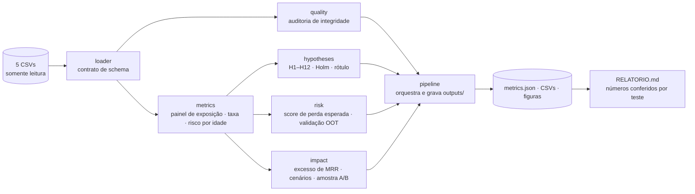

# Design: diagnostico-churn

## Visão geral

Pipeline em camadas, dependências só para dentro. Cada módulo tem uma razão
para mudar (SRP); os pontos de extensão são protocolos pequenos (OCP/ISP).



Texto alternativo: CSV → loader → (quality, metrics); metrics → (hypotheses,
risk, impact); todos → pipeline → outputs → relatório.

## Módulos

| Módulo | Responsabilidade (SRP) | Depende de |
|---|---|---|
| `config.py` | Caminhos, semente, constantes de negócio (`Settings` imutável) | — |
| `loader.py` | Ler CSVs, validar contrato (colunas/tipos), devolver `Tables` | config |
| `quality.py` | Duplicatas, violações de linha do tempo, concordância de rótulos | loader |
| `metrics.py` | Painel assinatura×mês, taxa mensal, risco por idade, padronização, controle | loader |
| `hypotheses.py` | `Finding`, Holm, registro H1–H12, invariância | metrics, loader |
| `risk.py` | `Scorer` (protocolo), `AgeHazardScorer`, benchmarks, painel OOT, métricas | metrics |
| `impact.py` | Excesso de MRR, cenários, tamanho de amostra | metrics |
| `figures.py` | Gráficos do relatório (matplotlib, sem estado global) | — |
| `pipeline.py` | Orquestra, grava `outputs/` de forma determinística | todos |

## Decisões (e o que foi descartado)

| Decisão | Por quê | Descartado |
|---|---|---|
| Unidade = assinatura × mês (tempo discreto) | Único par de datas consistente; permite taxa com denominador correto e risco por idade | Conta como unidade com `churn_flag` (flag sem data e contraditória) |
| Risco por idade da assinatura em tabela (5 faixas) | KISS; interpretável pelo CEO; venceu GBM fora do tempo na sondagem | Cox / Causal Forest (sem variação exógena, suposição de não-confusão implausível) |
| Benchmarks com todas as tabelas (logística, GBM) mantidos | Mostrar, com número, que "mais variáveis" não ajuda aqui (subespecificação) | SMOTE-NC (sobreamostrar ruído não cria sinal) |
| Invariância como checagem de estabilidade por ambiente | Pede pouco dado e responde "é estável?" — pré-requisito para chamar de candidato causal | IRM completo (5 ambientes e ~500 contas: poder baixo) |
| Controle estatístico (média + 3σ) na série de MRR | Detecta quebra estrutural sem dependências | TimesFM (YAGNI nesta fase) |
| Números do relatório marcados `<!--m:chave-->` e testados | Impede número inventado ou desatualizado no relatório (P-003) | Template gerando o relatório inteiro (texto ficaria engessado) |

## Protocolos (pontos de extensão)

```python
class Scorer(Protocol):          # OCP/LSP: qualquer score entra na validação
    name: str
    def fit(self, panel: pl.DataFrame) -> Self: ...
    def score(self, panel: pl.DataFrame) -> np.ndarray: ...
```

Hipóteses são funções `(Context) -> Finding` registradas numa tupla (`REGISTRY`):
adicionar H13 não mexe no executor.

## Contrato de saída (`outputs/`)

- `metrics.json` — todas as métricas citadas no relatório (chaves estáveis).
- `findings.csv` — H1–H12 com estatística, p, p Holm, efeito, rótulo, tabelas.
- `monthly_churn.csv`, `hazard_by_age.csv`, `invariance.csv`, `oot_validation.csv`.
- `cs_priority_accounts.csv` — lista acionável do CS.
- `figures/*.png` — gráficos do relatório.

## Segurança e dados

Dados sintéticos, sem PII (`account_name` é fictício). Nada de credenciais.
CSVs brutos são somente leitura (P-008). O caminho dos dados é injetado por
argumento/variável de ambiente (`RAVENSTACK_DATA_DIR`), nunca fixo no código.
