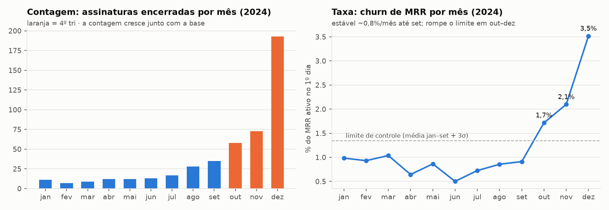
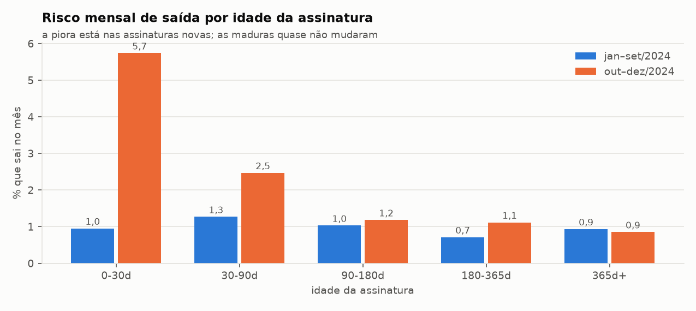
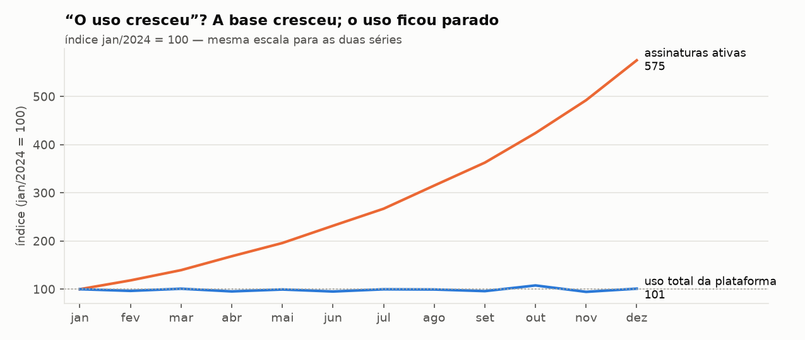
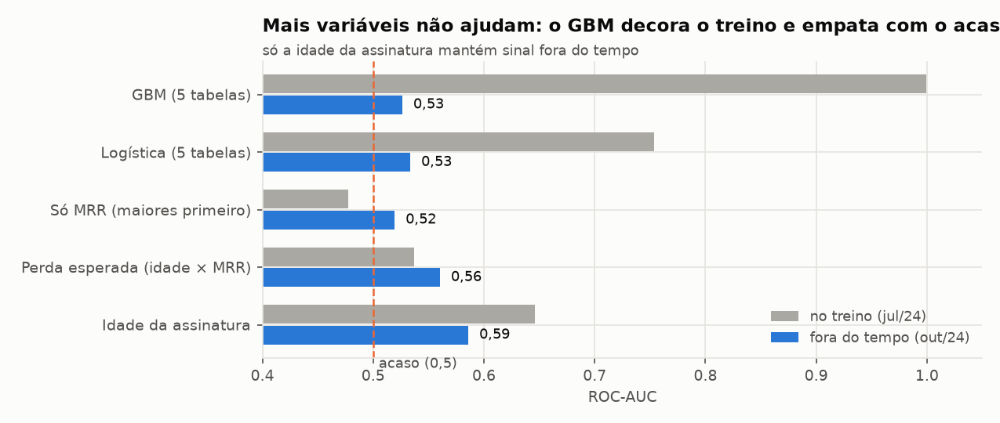

# Diagnóstico de churn — RavenStack

**Para:** CEO · **De:** AI Master · **Dados até:** 31/12/2024 · **Base:** as 5 tabelas (<!--m:n_accounts-->500 contas, <!--m:n_subscriptions-->5.000 assinaturas, <!--m:n_usage_events-->25.000 eventos de uso, <!--m:n_tickets-->2.000 tickets, <!--m:n_churn_events-->600 eventos de churn)

> Como ler: cada afirmação leva um selo — **[Fato]** (medido), **[Previsão]**
> (score validado) ou **[Hipótese]** (plausível, precisa de teste para virar
> decisão). Todo número deste relatório é conferido automaticamente contra o
> pipeline (`outputs/metrics.json`); se alguém editar um número à mão, o teste falha.

---

## A resposta em 30 segundos

1. **O churn subiu de verdade — mas só no 4º trimestre e só nas assinaturas novas.**
   O churn de MRR ficou estável em <!--m:mrr_churn_ref_avg_pct-->0,83% ao mês de
   janeiro a setembro e saltou para <!--m:mrr_churn_dec24_pct-->3,52% em dezembro.
   No 4º tri, saíram <!--m:q4_observed_ended-->324 assinaturas quando o esperado era
   <!--m:q4_expected_ended-->115 (<!--m:q4_ratio_x-->2,82×). <!--m:young_share_q4_events_pct-->79,6%
   dessas saídas são de assinaturas com menos de 90 dias. A base madura está estável.
   E isso é **novo**: até setembro, assinatura nova não saía mais que a madura.
2. **Por isso o CS e o Produto "não viram".** A satisfação (CSAT
   <!--m:csat_mean_2024-->3,97) é igual entre quem sai e quem fica, e o uso total
   ficou **parado** o ano inteiro enquanto a base cresceu <!--m:active_subs_growth_x-->5,8×.
   Os dois indicadores olham para o cliente antigo e satisfeito; o problema está no novo.
3. **Nenhum sinal de uso, suporte ou satisfação prevê quem vai sair.** Um modelo
   com as cinco tabelas acerta <!--m:oot_gbm_insample_roc-->1,00 no treino e
   <!--m:oot_gbm_roc-->0,52 fora dele (0,50 = cara ou coroa). A causa não está
   onde a empresa hoje procura.
4. **Alerta antes de gastar:** os dados têm defeitos graves (<!--m:usage_before_sub_start_pct-->76,6%
   do uso registrado *antes* da assinatura existir; <!--m:churn_def_disagree_pct-->80%
   das contas com definições de churn em conflito), e o padrão do churn precoce
   também é compatível com uma data de cancelamento atribuída em lote. **Um dia de
   auditoria no billing decide se o salto é de clientes ou de registro.**
5. **O que fazer:** (0) auditar 20 cancelamentos de dezembro; (1) onboarding
   D+7/D+30 para assinaturas novas, como teste A/B; (2) o CS liga esta semana
   para as <!--m:cs_top_n-->50 contas da lista; (3) uma definição única de churn;
   (4) trocar CSAT e "uso total" por **churn de MRR por idade da assinatura** no board.
   Em jogo: <!--m:excess_mrr_per_month_k-->221 mil dólares de MRR por mês acima do normal.
6. **Duas perguntas só a diretoria responde** (seção 3): *o que mudou em
   set–out/2024?* e *qual é a definição oficial de churn?* Sem a primeira, a
   causa fica sem nome e as ações ficam no nível de hipótese.

---

## 1. O que está causando o churn

### 1.1 O churn subiu em taxa, não só em contagem [Fato]

A contagem de cancelamentos engana: ela sobe sempre que a base cresce. As
assinaturas ativas passaram de <!--m:active_subs_jan24-->656 (jan/24) para
<!--m:active_subs_dec24-->3.773 (dez/24). Medido como **taxa** sobre a base ativa
no 1º dia do mês, o churn de MRR ficou dentro do normal até setembro e rompeu o
limite de controle estatístico (<!--m:control_ucl_pct-->1,35%) nos
<!--m:control_breaks-->3 meses do 4º tri: <!--m:mrr_churn_oct24_pct-->1,72%,
<!--m:mrr_churn_nov24_pct-->2,10% e <!--m:mrr_churn_dec24_pct-->3,52%. Em
assinaturas, a taxa foi de <!--m:sub_churn_ref_avg_pct-->1,03% para
<!--m:sub_churn_dec24_pct-->2,46% ao mês.

### 1.2 A alta está concentrada nas assinaturas novas [Fato]

Comparando cada faixa de idade com ela mesma (para o crescimento da base não
enganar), o risco de sair no **primeiro mês** foi de <!--m:hz_0_30_ref_pct-->0,95%
para <!--m:hz_0_30_target_pct-->5,74% (<!--m:hz_0_30_mult_x-->6×); de 30 a 90 dias,
de <!--m:hz_30_90_ref_pct-->1,27% para <!--m:hz_30_90_target_pct-->2,47%. Nas
assinaturas com mais de 90 dias quase nada mudou (<!--m:hz_mature_ref_pct-->0,88% →
<!--m:hz_mature_target_pct-->1,09%). Em MRR, o 4º tri perdeu
US$ <!--m:q4_mrr_lost_k-->872 mil contra US$ <!--m:q4_mrr_expected_k-->209 mil
esperados (<!--m:q4_mrr_ratio_x-->4,16×).

**É estável?** Entre perfis de cliente, sim: a relação "assinatura nova sai
mais" aparece nos <!--m:invariance_envs-->13 ambientes testados (5 indústrias,
3 planos, 5 canais), com razão de risco entre <!--m:invariance_hr_min_x-->1,9× e
<!--m:invariance_hr_max_x-->3,7× e intervalo de confiança acima de 1 em
<!--m:invariance_ci_excludes_1-->13 de 13. **No tempo, não:** tratando a quebra de
set–out/2024 como ambiente, a razão era <!--m:hr_before_break_x-->1,2× antes
(intervalo <!--m:hr_before_ci_low-->0,90–<!--m:hr_before_ci_high-->1,72, ou seja,
sem diferença) e passou a <!--m:hr_after_break_x-->4,1× depois
(<!--m:hr_after_ci_low-->3,14–<!--m:hr_after_ci_high-->5,36). Conclusão: "assinatura
nova sai mais" não é uma característica permanente do negócio — é um **regime
novo, que começou em outubro**. A causa está no que mudou ali (pergunta 1 da
seção 3) — e um defeito de registro também produziria esse padrão (item 1.4).

### 1.3 O que NÃO explica o churn (e por que isso importa) [Fato]

Testei <!--m:n_hypotheses-->12 hipóteses cruzando as cinco tabelas, com correção
para múltiplas comparações (Holm). Só <!--m:n_significant-->2 sobrevivem — as duas
acima. As outras dizem onde **não** gastar dinheiro:

| Hipótese comum | O que os dados mostram | Tabelas |
|---|---|---|
| "Satisfação está ok" (CS) | É verdade (CSAT <!--m:csat_mean_2024-->3,97), mas o CSAT **não separa** quem sai de quem fica (AUC <!--m:csat_auc-->0,52) e <!--m:csat_missing_pct-->41,2% dos tickets nem têm nota. É a métrica errada para retenção. | tickets × assinaturas × contas |
| "O uso cresceu" (Produto) | O uso total ficou entre <!--m:usage_monthly_min-->10.039 e <!--m:usage_monthly_max-->11.450 eventos/mês o ano todo (tendência p = <!--m:usage_trend_p-->0,88). Por assinatura ativa, caiu <!--m:usage_change_per_sub_pct-->−83,2%. Só o uso *acumulado* cresce. | uso × assinaturas |
| "Saem por causa do suporte" | Quem declarou "suporte" como motivo não teve mais tickets nem escalações que os demais (AUC <!--m:support_reason_auc-->0,50). | churn × tickets |
| "O motivo de saída explica" | O motivo codificado e o comentário do cliente não concordam (V de Cramér <!--m:reason_feedback_cramers_v-->0,065, ~0 = independentes); cada motivo tem entre <!--m:reason_share_min_pct-->15,2% e <!--m:reason_share_max_pct-->19% — uma distribuição plana. O formulário de saída não informa. | churn |
| "É um segmento (indústria, país, canal, plano)" | Nenhum difere depois da correção (menor p ajustado = <!--m:segments_min_p_holm-->0,30). | assinaturas × contas |

### 1.4 Causa raiz provável — e o que ainda é hipótese

**[Hipótese] O salto de vendas do 4º tri trouxe assinaturas que não se sustentam.**
As novas assinaturas foram de <!--m:starts_q3_24-->1.107 no 3º tri para
<!--m:starts_q4_24-->2.069 no 4º tri, e o risco do primeiro mês acompanha esse volume (correlação <!--m:h8_rho-->0,69, p = <!--m:h8_p-->0,013).
Mas as duas séries crescem no tempo — tendência comum produz correlação sem
causa — e, corrigindo para múltiplos testes, p = <!--m:h8_p_holm-->0,13. Por isso é
hipótese, com o teste que a valida (ação 1).

**[Fato] O churn acumulado por coorte não cresce com o tempo de vida — sinal de
possível defeito de registro.** Em SaaS de verdade, uma coorte com 13 meses de
vida acumulou mais cancelamentos que uma com 1 mês. Aqui não: a coorte do 4º tri/2023 perdeu <!--m:cohort_2023q4_ever_ended_pct-->11%
em <!--m:cohort_2023q4_days_observed-->407 dias e a do 4º tri/2024,
<!--m:cohort_2024q4_ever_ended_pct-->10,1% em <!--m:cohort_2024q4_days_observed-->38
dias — a mesma fração com 10× menos tempo de exposição (pelo risco de referência,
deveria ser ~1%). E o cancelamento cai, em mediana, na metade
(<!--m:duration_ratio_median-->0,5) do tempo observado de cada assinatura. Duas
explicações produzem esse padrão: **(a)** um colapso real do início de vida nas
assinaturas recentes — o que a ação 1 ataca; **(b)** uma data de fim atribuída
por processo (backfill, cancelamento administrativo em lote) — nesse caso **o
problema é de dados, não de clientes**. Os dados sozinhos não separam as duas; a
ação 0 separa em um dia.

---

## 2. Quem está em risco

**O segmento em risco é "assinatura com menos de 90 dias", em qualquer indústria,
plano ou canal** — não um perfil de empresa. Projetando o risco atual por idade
para os próximos 90 dias, **US$ <!--m:expected_loss_90d_k-->518 mil de MRR**
(<!--m:expected_loss_90d_pct-->5,1% dos US$ <!--m:paid_mrr_active_k-->10.160 mil
ativos) devem sair [Previsão].

As <!--m:cs_top_n-->50 contas da lista do CS concentram
US$ <!--m:cs_top_expected_loss_k-->171 mil dessa perda esperada
(<!--m:cs_top_share_of_loss_pct-->33% do total). As 10 primeiras:

<!--top10:start-->
| # | Conta | Nome | Indústria | Plano inicial | MRR ativo (US$) | Assinaturas < 90 dias | Perda esperada 90d (US$) |
|---|---|---|---|---|---|---|---|
| 1 | `A-18793f` | Company_488 | EdTech | Basic | 75.776 | 8 | 8.038 |
| 2 | `A-d4e0d4` | Company_403 | FinTech | Basic | 114.777 | 9 | 7.781 |
| 3 | `A-5c046d` | Company_130 | EdTech | Basic | 83.886 | 5 | 6.346 |
| 4 | `A-4814a3` | Company_337 | Cybersecurity | Basic | 70.644 | 7 | 5.028 |
| 5 | `A-9174e0` | Company_73 | Cybersecurity | Basic | 46.613 | 12 | 4.945 |
| 6 | `A-09316c` | Company_341 | FinTech | Enterprise | 70.000 | 7 | 4.899 |
| 7 | `A-5b1bcd` | Company_166 | DevTools | Pro | 131.911 | 3 | 4.427 |
| 8 | `A-56962b` | Company_177 | EdTech | Enterprise | 54.605 | 1 | 4.242 |
| 9 | `A-c70870` | Company_253 | Cybersecurity | Basic | 39.614 | 4 | 4.177 |
| 10 | `A-e08cd3` | Company_475 | FinTech | Pro | 67.737 | 8 | 3.819 |
<!--top10:end-->

Lista completa, com motivo e ação sugerida por conta:
[`outputs/cs_priority_accounts.csv`](outputs/cs_priority_accounts.csv). O CS
regenera todo mês com `uv run python -m churn_diag`.

**Quão bom é esse score? (honestidade sobre o modelo)**

Treinei em julho e testei em outubro (sem espiar o futuro), em
<!--m:oot_n_test-->2.330 assinaturas com <!--m:oot_base_rate_pct-->4,1% de saídas.
Só a **idade da assinatura** tem sinal real (ROC <!--m:oot_age_roc-->0,59,
p = <!--m:oot_age_p-->0,003). O GBM com as cinco tabelas decorou o treino e
empatou com o acaso (<!--m:oot_gbm_roc-->0,52); a logística, <!--m:oot_logit_roc-->0,53.
Em dólares, ligar primeiro para as maiores assinaturas captura
<!--m:oot_mrr_only_mrr_recall_pct-->58,2% do MRR que sai nos 10% do topo; o score
de perda esperada, <!--m:oot_expected_loss_mrr_recall_pct-->49%; o GBM,
<!--m:oot_gbm_mrr_recall_pct-->9,7%. A diferença entre
os dois primeiros está dentro do ruído (só <!--m:oot_positives-->96 saídas no teste). **Leitura:** o score serve para
priorizar a fila do CS (risco × dinheiro), não para prometer quem vai sair.

---

## 3. O que os dados não conseguem responder (e por que importa)

Estas duas perguntas não são detalhe técnico: são achados de primeira ordem.
Os dados confirmam **que** algo mudou; não conseguem dizer **o quê**.

**Pergunta 1 — O que mudou entre setembro e outubro de 2024?**

- **O que os dados mostram:** uma quebra estrutural na taxa de churn a partir de
  outubro (<!--m:control_breaks-->3 meses acima do limite de controle) e o surgimento do risco extra
  das assinaturas novas (razão <!--m:hr_before_break_x-->1,2× antes →
  <!--m:hr_after_break_x-->4,1× depois).
- **O que os dados não permitem:** saber se a causa é interna (preço, plano,
  release, processo de onboarding ou renovação) ou externa (concorrente,
  mercado), nem medir o tamanho do efeito dela. Nenhuma das 5 tabelas registra
  esse tipo de evento.
- **Por que importa:** sem o evento, não dá para desenhar a intervenção certa
  nem estimar seu efeito (diferenças-em-diferenças precisa de uma data e de um
  grupo afetado). As recomendações ficam no nível de hipótese.
- **O que fiz enquanto isso:** tratei a quebra como um *ambiente* (antes/depois),
  não como causa identificada — registrado como suposição de risco alto.
- **Quem responde:** CEO, com Vendas, Produto e CS — houve mudança de preço, de
  plano ou de política? Release com regressão conhecida? Mudança no onboarding
  ou na renovação? Campanha de upsell? · **Prazo proposto:** esta semana
  (ação 5).

**Pergunta 2 — Qual é a definição oficial de churn da RavenStack?**

- **O que os dados mostram:** as três definições do dataset discordam em
  <!--m:churn_def_disagree_pct-->80% das contas.
- **O que fiz:** construí uma definição técnica — MRR perdido por cancelamento
  completo de assinatura, com data — confirmada pelo dono do produto.
- **Por que importa:** se Financeiro/RevOps mede o churn de outro jeito, os
  números deste relatório não serão comparáveis com os do board.
- **Quem responde:** CEO com Financeiro/RevOps · **Prazo proposto:** 30 dias
  (junto com a ação 3).

---

## 4. O que fazer — priorizado

| # | Ação | Dono · prazo | Custo | Impacto estimado | Como saber se funcionou |
|---|---|---|---|---|---|
| 0 | **Auditar 20 cancelamentos de dezembro no billing** (data real vs `end_date`) | Financeiro + Eng · 1 dia | ~0 | Decide se os US$ <!--m:excess_mrr_per_month_k-->221 mil/mês de excesso são clientes saindo ou defeito de dado | ≥ 80% das datas batem → segue o plano; senão, corrigir o registro antes de tudo |
| 1 | **Onboarding D+7/D+30 para assinaturas novas, como teste A/B** (metade recebe, metade não) | CS · começa em 2 semanas | 1 CSM dedicado | Se reduzir o excesso em 25% / 50% / 75%: US$ <!--m:recovery_25_mrr_month_k-->55 / <!--m:recovery_50_mrr_month_k-->110 / <!--m:recovery_75_mrr_month_k-->166 mil de MRR preservados por mês (cenário de 50% ≈ US$ <!--m:recovery_50_arr_equiv_k-->1.325 mil de ARR) | Saída no 1º mês: <!--m:ab_p0_pct-->5,75% no controle vs meta <!--m:ab_p1_pct-->2,87%; <!--m:ab_n_per_arm-->783 assinaturas por braço ≈ <!--m:ab_weeks_to_enroll-->11,6 semanas com <!--m:ab_new_paid_subs_month-->586 novas pagas/mês |
| 2 | **CS liga para as 50 contas da lista** (top 10 com CSM sênior em 7 dias) | CS · esta semana | tempo do time | Cobre US$ <!--m:cs_top_expected_loss_k-->171 mil de MRR em risco em 90 dias | Churn de MRR dessas contas vs. as 50 seguintes da lista no próximo trimestre |
| 3 | **Uma definição única de churn + instrumentação ligada ao ciclo de vida** (uso e tickets só dentro da assinatura) — responde a pergunta 2 | Dados/Eng · 30 dias | 1 sprint | Pré-requisito: sem isso, qualquer "health score" é ruído (hoje <!--m:churn_def_disagree-->400 contas mudam de status conforme a tabela) | As 3 definições concordam; 0% de eventos fora da janela da assinatura |
| 4 | **Board mensal: churn de MRR por idade da assinatura** no lugar de CSAT e "uso total" | CEO/RevOps · próxima reunião | ~0 | Foi a métrica que revelou o problema; as outras duas o esconderam | Métrica publicada e com limite de controle todo mês |
| 5 | **Perguntar a Vendas/Produto/CS o que mudou em set–out/2024** (campanha, preço, release, onboarding?) — pergunta 1 | CEO · esta semana | ~0 | É o candidato a experimento natural: se houve mudança com data, dá para medir o efeito dela | Resposta registrada (pergunta Q-001 da especificação) |

**Por que nessa ordem:** a ação 0 custa um dia e pode mudar todo o resto; as
ações 1 e 2 atacam o único sinal robusto sem esperar a causa (1 é experimento,
2 é priorização); a 3 e a 4 impedem que o próximo diagnóstico repita este. A
análise causal da quebra (diferenças-em-diferenças) espera a resposta da
pergunta 1. Nenhuma ação é "melhorar a experiência do cliente".

---

## 5. Limitações — o que eu não consegui verificar

- **Dados sintéticos com linhas do tempo quebradas.** <!--m:usage_before_signup_pct-->52,8%
  do uso e <!--m:tickets_before_signup_pct-->53,9% dos tickets são anteriores ao
  cadastro da conta; <!--m:churn_events_before_first_sub-->53 eventos de churn
  acontecem antes da primeira assinatura. Por isso **não** montei janelas "30 dias
  antes do churn" com uso ou tickets: elas seriam ruído com cara de insight.
- **Três definições de churn discordam** (flag da conta: <!--m:churn_def_flag_account-->110
  contas; eventos de churn: <!--m:churn_def_events-->352; assinatura encerrada:
  <!--m:churn_def_sub_ended-->312). A definição usada — **cancelamento completo da
  assinatura, com o MRR integral dela** (churn bruto) — é a única com data
  consistente e foi confirmada pelo dono do produto (ASM-001). Downgrade não
  conta como churn (é uma flag sem data nem valor); o `churn_flag` da conta serve
  só como checagem de consistência.
- **Nenhuma ação tem efeito causal provado.** Não existe variação exógena nos
  dados; os números de impacto dizem quanto está em jogo, não quanto cada ação
  devolve. Por isso a ação 1 é um teste A/B, não um rollout.
- **Amostra pequena na validação** (<!--m:oot_positives-->96 saídas no período de teste): diferenças
  de poucos pontos entre scores não são conclusivas.
- **IDs de uso colidem** (<!--m:usage_id_collisions-->21 IDs repetidos com
  conteúdo diferente — IDs curtos). Deduplicar por ID apagaria eventos reais; não deduplicado.

---

Reprodução: `uv run python -m churn_diag` regenera `outputs/` byte a byte;
`uv run pytest` roda a suíte de testes (inclusive a que confere cada número
marcado deste relatório). Especificação e auditoria: `.spec/` (onp-spec). Apêndice
técnico: `notebooks/diagnostico_churn.ipynb`.
